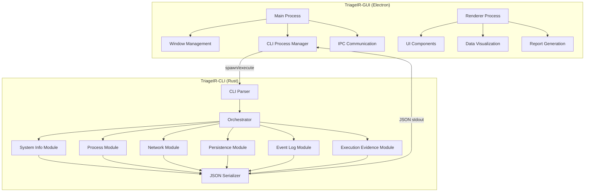

# TriageIR Developer Guide

## Table of Contents

1. [Architecture Overview](#architecture-overview)
2. [Development Environment Setup](#development-environment-setup)
3. [CLI Development](#cli-development)
4. [GUI Development](#gui-development)
5. [API Reference](#api-reference)
6. [Testing Framework](#testing-framework)
7. [Build and Deployment](#build-and-deployment)
8. [Contributing Guidelines](#contributing-guidelines)
9. [Performance Optimization](#performance-optimization)
10. [Security Considerations](#security-considerations)

## Architecture Overview

TriageIR implements a decoupled hybrid architecture with two main components:

### Component Architecture



### Design Principles

1. **Separation of Concerns**: CLI handles data collection, GUI handles presentation
2. **Forensic Integrity**: CLI maintains forensic soundness with minimal system impact
3. **Modularity**: Each component is independently testable and maintainable
4. **Performance**: Optimized for speed and resource efficiency
5. **Extensibility**: Easy to add new artifact collection modules

## Development Environment Setup

### Prerequisites

#### For CLI Development (Rust)
```bash
# Install Rust toolchain
curl --proto '=https' --tlsv1.2 -sSf https://sh.rustup.rs | sh
rustup update stable

# Windows-specific dependencies
# Install Visual Studio Build Tools or Visual Studio Community
# Install Windows SDK
```

#### For GUI Development (Node.js/Electron)
```bash
# Install Node.js (version 16 or later)
# Download from https://nodejs.org/

# Verify installation
node --version
npm --version
```

### Repository Setup

```bash
# Clone the repository
git clone <repository-url>
cd TriageIR

# Set up CLI development environment
cd TriageIR-CLI
cargo build
cargo test

# Set up GUI development environment
cd ../TriageIR-GUI
npm install
npm run dev
```

### Development Tools

#### Recommended IDE Setup
- **Rust**: VS Code with rust-analyzer extension
- **JavaScript/TypeScript**: VS Code with ESLint and Prettier
- **Git**: Git for version control with conventional commits

#### Useful Extensions
- rust-analyzer (Rust language support)
- Error Lens (inline error display)
- GitLens (Git integration)
- Prettier (code formatting)
- ESLint (JavaScript linting)

## CLI Development

### Project Structure

```
TriageIR-CLI/
├── src/
│   ├── main.rs              # Application entry point and CLI parsing
│   ├── types.rs             # Data structures and serialization
│   ├── system_info.rs       # System information collection
│   ├── processes.rs         # Process enumeration and analysis
│   ├── network.rs           # Network connection enumeration
│   ├── persistence.rs       # Persistence mechanism detection
│   ├── event_logs.rs        # Windows Event Log collection
│   ├── prefetch.rs          # Windows Prefetch analysis
│   ├── shimcache.rs         # Application Compatibility Cache
│   ├── evidence_package.rs  # Evidence packaging and integrity
│   ├── logger.rs            # Logging infrastructure
│   └── lib.rs               # Library interface
├── tests/
│   ├── integration_tests.rs # Integration tests
│   ├── performance_tests.rs # Performance benchmarks
│   └── test_data/           # Test data files
├── examples/                # Usage examples
├── Cargo.toml              # Dependencies and metadata
└── build.rs                # Build script (if needed)
```

### Core Data Structures

#### Main Result Structure
```rust
#[derive(Serialize, Deserialize, Debug, Clone)]
pub struct ScanResults {
    pub scan_metadata: ScanMetadata,
    pub artifacts: Artifacts,
    pub collection_log: Vec<LogEntry>,
}

#[derive(Serialize, Deserialize, Debug, Clone)]
pub struct ScanMetadata {
    pub scan_id: String,
    pub scan_start_utc: String,
    pub scan_duration_ms: u64,
    pub hostname: String,
    pub os_version: String,
    pub cli_version: String,
}

#[derive(Serialize, Deserialize, Debug, Clone)]
pub struct Artifacts {
    pub system_info: SystemInfo,
    pub running_processes: Vec<Process>,
    pub network_connections: Vec<NetworkConnection>,
    pub persistence_mechanisms: Vec<PersistenceMechanism>,
    pub event_logs: EventLogs,
    pub execution_evidence: ExecutionEvidence,
}
```

#### Process Structure
```rust
#[derive(Serialize, Deserialize, Debug, Clone)]
pub struct Process {
    pub pid: u32,
    pub parent_pid: u32,
    pub name: String,
    pub command_line: String,
    pub executable_path: String,
    pub sha256_hash: Option<String>,
    pub loaded_dlls: Vec<LoadedDll>,
    pub memory_usage: u64,
    pub cpu_usage: f32,
    pub start_time: String,
}
```

### Adding New Collection Modules

#### Step 1: Define Data Structures
```rust
// In types.rs
#[derive(Serialize, Deserialize, Debug, Clone)]
pub struct NewArtifactType {
    pub id: String,
    pub name: String,
    pub data: String,
    pub timestamp: String,
}
```

#### Step 2: Create Collection Module
```rust
// In new_module.rs
use crate::types::*;
use crate::logger::Logger;

pub struct NewModuleCollector {
    logger: Logger,
}

impl NewModuleCollector {
    pub fn new(logger: Logger) -> Self {
        Self { logger }
    }

    pub fn collect(&self) -> Result<Vec<NewArtifactType>, Box<dyn std::error::Error>> {
        self.logger.info("Starting new artifact collection");
        
        let mut artifacts = Vec::new();
        
        // Collection logic here
        
        self.logger.info(&format!("Collected {} artifacts", artifacts.len()));
        Ok(artifacts)
    }
}
```

#### Step 3: Integrate with Main Application
```rust
// In main.rs
mod new_module;
use new_module::NewModuleCollector;

// Add to main collection function
let new_collector = NewModuleCollector::new(logger.clone());
let new_artifacts = new_collector.collect()?;
artifacts.new_artifacts = new_artifacts;
```

### Error Handling Patterns

```rust
use std::error::Error;
use std::fmt;

#[derive(Debug)]
pub enum CollectionError {
    AccessDenied(String),
    SystemError(String),
    ParseError(String),
}

impl fmt::Display for CollectionError {
    fn fmt(&self, f: &mut fmt::Formatter) -> fmt::Result {
        match self {
            CollectionError::AccessDenied(msg) => write!(f, "Access denied: {}", msg),
            CollectionError::SystemError(msg) => write!(f, "System error: {}", msg),
            CollectionError::ParseError(msg) => write!(f, "Parse error: {}", msg),
        }
    }
}

impl Error for CollectionError {}

// Usage in collection modules
pub fn collect_with_error_handling() -> Result<Vec<Artifact>, CollectionError> {
    match unsafe_system_call() {
        Ok(data) => Ok(parse_data(data)?),
        Err(e) => {
            if e.kind() == ErrorKind::PermissionDenied {
                Err(CollectionError::AccessDenied(e.to_string()))
            } else {
                Err(CollectionError::SystemError(e.to_string()))
            }
        }
    }
}
```

### Testing Patterns

#### Unit Tests
```rust
#[cfg(test)]
mod tests {
    use super::*;
    use tempfile::tempdir;

    #[test]
    fn test_process_collection() {
        let logger = Logger::new_test();
        let collector = ProcessCollector::new(logger);
        
        let processes = collector.collect().unwrap();
        assert!(!processes.is_empty());
        
        // Verify required fields
        for process in &processes {
            assert!(!process.name.is_empty());
            assert!(process.pid > 0);
        }
    }

    #[test]
    fn test_json_serialization() {
        let process = Process {
            pid: 1234,
            name: "test.exe".to_string(),
            // ... other fields
        };
        
        let json = serde_json::to_string(&process).unwrap();
        let deserialized: Process = serde_json::from_str(&json).unwrap();
        
        assert_eq!(process.pid, deserialized.pid);
        assert_eq!(process.name, deserialized.name);
    }
}
```

#### Integration Tests
```rust
// In tests/integration_tests.rs
use std::process::Command;
use tempfile::tempdir;

#[test]
fn test_cli_basic_execution() {
    let output = Command::new("target/debug/triageir-cli")
        .arg("--output")
        .arg("test_output.json")
        .output()
        .expect("Failed to execute CLI");

    assert!(output.status.success());
    
    // Verify JSON output
    let json_content = std::fs::read_to_string("test_output.json").unwrap();
    let scan_results: ScanResults = serde_json::from_str(&json_content).unwrap();
    
    assert!(!scan_results.artifacts.running_processes.is_empty());
}
```

## GUI Development

### Project Structure

```
TriageIR-GUI/
├── src/
│   ├── main.js              # Electron main process
│   ├── preload.js           # Preload script for security
│   └── renderer/
│       ├── index.html       # Main HTML template
│       ├── styles/
│       │   └── main.css     # Application styles
│       └── js/
│           ├── app.js       # Main application logic
│           ├── cli-manager.js # CLI process management
│           ├── data-parser.js # JSON data parsing
│           └── report-generator.js # Report generation
├── test/
│   ├── gui-tests.js         # GUI integration tests
│   └── test-data/           # Test JSON files
├── package.json             # Dependencies and scripts
└── electron-builder.json   # Build configuration
```

### Main Process (main.js)

```javascript
const { app, BrowserWindow, ipcMain, dialog } = require('electron');
const path = require('path');
const { spawn } = require('child_process');

class TriageIRApp {
    constructor() {
        this.mainWindow = null;
        this.cliProcess = null;
    }

    createWindow() {
        this.mainWindow = new BrowserWindow({
            width: 1200,
            height: 800,
            webPreferences: {
                nodeIntegration: false,
                contextIsolation: true,
                preload: path.join(__dirname, 'preload.js')
            }
        });

        this.mainWindow.loadFile('src/renderer/index.html');
    }

    setupIPC() {
        ipcMain.handle('run-cli-scan', async (event, options) => {
            return this.runCliScan(options);
        });

        ipcMain.handle('save-results', async (event, data) => {
            return this.saveResults(data);
        });
    }

    async runCliScan(options) {
        return new Promise((resolve, reject) => {
            const cliPath = this.findCliExecutable();
            const args = ['--format', 'json'];
            
            if (options.verbose) args.push('--verbose');
            if (options.skipHashes) args.push('--skip-hashes');

            this.cliProcess = spawn(cliPath, args);
            let stdout = '';
            let stderr = '';

            this.cliProcess.stdout.on('data', (data) => {
                stdout += data.toString();
            });

            this.cliProcess.stderr.on('data', (data) => {
                stderr += data.toString();
                // Send progress updates to renderer
                this.mainWindow.webContents.send('scan-progress', data.toString());
            });

            this.cliProcess.on('close', (code) => {
                if (code === 0) {
                    try {
                        const results = JSON.parse(stdout);
                        resolve(results);
                    } catch (error) {
                        reject(new Error(`JSON parse error: ${error.message}`));
                    }
                } else {
                    reject(new Error(`CLI exited with code ${code}: ${stderr}`));
                }
            });
        });
    }

    findCliExecutable() {
        const possiblePaths = [
            path.join(__dirname, '../../TriageIR-CLI/target/release/triageir-cli.exe'),
            path.join(__dirname, '../../TriageIR-CLI/target/debug/triageir-cli.exe'),
            path.join(process.resourcesPath, 'triageir-cli.exe'),
            'triageir-cli.exe' // In PATH
        ];

        for (const cliPath of possiblePaths) {
            if (require('fs').existsSync(cliPath)) {
                return cliPath;
            }
        }

        throw new Error('TriageIR CLI executable not found');
    }
}

const app_instance = new TriageIRApp();

app.whenReady().then(() => {
    app_instance.createWindow();
    app_instance.setupIPC();
});
```

### Renderer Process Components

#### CLI Manager (cli-manager.js)
```javascript
class CLIManager {
    constructor() {
        this.isScanning = false;
        this.currentScan = null;
    }

    async startScan(options = {}) {
        if (this.isScanning) {
            throw new Error('Scan already in progress');
        }

        this.isScanning = true;
        
        try {
            const results = await window.electronAPI.runCliScan(options);
            this.isScanning = false;
            return results;
        } catch (error) {
            this.isScanning = false;
            throw error;
        }
    }

    cancelScan() {
        if (this.isScanning && this.currentScan) {
            // Send cancellation signal
            window.electronAPI.cancelScan();
            this.isScanning = false;
        }
    }

    onProgress(callback) {
        window.electronAPI.onScanProgress(callback);
    }
}
```

#### Data Parser (data-parser.js)
```javascript
class DataParser {
    static validateScanResults(data) {
        const required = ['scan_metadata', 'artifacts', 'collection_log'];
        
        for (const field of required) {
            if (!data[field]) {
                throw new Error(`Missing required field: ${field}`);
            }
        }

        return true;
    }

    static parseProcesses(processes) {
        return processes.map(process => ({
            ...process,
            formattedStartTime: new Date(process.start_time).toLocaleString(),
            formattedMemory: this.formatBytes(process.memory_usage),
            hasHash: !!process.sha256_hash
        }));
    }

    static parseNetworkConnections(connections) {
        return connections.map(conn => ({
            ...conn,
            displayAddress: `${conn.local_address} → ${conn.remote_address}`,
            isListening: conn.state === 'LISTENING',
            isEstablished: conn.state === 'ESTABLISHED'
        }));
    }

    static formatBytes(bytes) {
        if (bytes === 0) return '0 Bytes';
        
        const k = 1024;
        const sizes = ['Bytes', 'KB', 'MB', 'GB'];
        const i = Math.floor(Math.log(bytes) / Math.log(k));
        
        return parseFloat((bytes / Math.pow(k, i)).toFixed(2)) + ' ' + sizes[i];
    }
}
```

### UI Components

#### Results Viewer
```javascript
class ResultsViewer {
    constructor(containerId) {
        this.container = document.getElementById(containerId);
        this.currentData = null;
    }

    displayResults(scanResults) {
        this.currentData = scanResults;
        this.createTabs();
        this.populateSystemInfo();
        this.populateProcesses();
        this.populateNetwork();
        this.populatePersistence();
        this.populateEventLogs();
        this.populateExecutionEvidence();
    }

    createTabs() {
        const tabsHtml = `
            <div class="tabs">
                <button class="tab-button active" data-tab="system">System Info</button>
                <button class="tab-button" data-tab="processes">Processes</button>
                <button class="tab-button" data-tab="network">Network</button>
                <button class="tab-button" data-tab="persistence">Persistence</button>
                <button class="tab-button" data-tab="events">Event Logs</button>
                <button class="tab-button" data-tab="execution">Execution Evidence</button>
            </div>
            <div class="tab-content">
                <div id="system-tab" class="tab-pane active"></div>
                <div id="processes-tab" class="tab-pane"></div>
                <div id="network-tab" class="tab-pane"></div>
                <div id="persistence-tab" class="tab-pane"></div>
                <div id="events-tab" class="tab-pane"></div>
                <div id="execution-tab" class="tab-pane"></div>
            </div>
        `;
        
        this.container.innerHTML = tabsHtml;
        this.setupTabHandlers();
    }

    populateProcesses() {
        const processes = DataParser.parseProcesses(this.currentData.artifacts.running_processes);
        const tableHtml = this.createProcessTable(processes);
        document.getElementById('processes-tab').innerHTML = tableHtml;
    }

    createProcessTable(processes) {
        const rows = processes.map(process => `
            <tr>
                <td>${process.pid}</td>
                <td>${process.parent_pid}</td>
                <td>${process.name}</td>
                <td title="${process.command_line}">${this.truncateText(process.command_line, 50)}</td>
                <td title="${process.executable_path}">${this.truncateText(process.executable_path, 40)}</td>
                <td>${process.formattedMemory}</td>
                <td>${process.hasHash ? '✓' : '✗'}</td>
            </tr>
        `).join('');

        return `
            <div class="table-container">
                <table class="data-table">
                    <thead>
                        <tr>
                            <th>PID</th>
                            <th>PPID</th>
                            <th>Name</th>
                            <th>Command Line</th>
                            <th>Executable Path</th>
                            <th>Memory</th>
                            <th>Hash</th>
                        </tr>
                    </thead>
                    <tbody>
                        ${rows}
                    </tbody>
                </table>
            </div>
        `;
    }
}
```

## API Reference

### CLI Command Line Interface

#### Basic Usage
```bash
triageir-cli [OPTIONS]
```

#### Options
- `--output, -o <FILE>`: Output file path
- `--verbose, -v`: Enable verbose logging
- `--skip-hashes`: Skip process hash calculation
- `--skip-events`: Skip event log collection
- `--max-events <NUM>`: Limit event log entries
- `--only <TYPES>`: Collect specific artifact types
- `--help, -h`: Show help information
- `--version, -V`: Show version information

#### Exit Codes
- `0`: Success
- `1`: Non-fatal errors
- `2`: Fatal errors

### JSON Schema

#### Root Schema
```json
{
  "$schema": "http://json-schema.org/draft-07/schema#",
  "type": "object",
  "required": ["scan_metadata", "artifacts", "collection_log"],
  "properties": {
    "scan_metadata": { "$ref": "#/definitions/ScanMetadata" },
    "artifacts": { "$ref": "#/definitions/Artifacts" },
    "collection_log": {
      "type": "array",
      "items": { "$ref": "#/definitions/LogEntry" }
    }
  }
}
```

#### Process Schema
```json
{
  "definitions": {
    "Process": {
      "type": "object",
      "required": ["pid", "parent_pid", "name", "command_line", "executable_path"],
      "properties": {
        "pid": { "type": "integer", "minimum": 0 },
        "parent_pid": { "type": "integer", "minimum": 0 },
        "name": { "type": "string" },
        "command_line": { "type": "string" },
        "executable_path": { "type": "string" },
        "sha256_hash": { "type": ["string", "null"] },
        "loaded_dlls": {
          "type": "array",
          "items": { "$ref": "#/definitions/LoadedDll" }
        }
      }
    }
  }
}
```

### GUI IPC API

#### Main Process → Renderer
```javascript
// Scan progress updates
window.electronAPI.onScanProgress((progressData) => {
    console.log('Scan progress:', progressData);
});

// Scan completion
window.electronAPI.onScanComplete((results) => {
    console.log('Scan completed:', results);
});
```

#### Renderer → Main Process
```javascript
// Start scan
const results = await window.electronAPI.runCliScan({
    verbose: true,
    skipHashes: false,
    maxEvents: 1000
});

// Save results
await window.electronAPI.saveResults(results);

// Open file dialog
const filePath = await window.electronAPI.openFileDialog();
```

## Testing Framework

### CLI Testing

#### Unit Tests
```rust
// Run unit tests
cargo test --lib

// Run with coverage
cargo test --lib -- --nocapture

// Test specific module
cargo test processes::tests
```

#### Integration Tests
```rust
// Run integration tests
cargo test --test integration_tests

// Run performance tests
cargo test --test performance_tests --release
```

#### Test Data Generation
```rust
// Generate test data for development
cargo run --example generate_test_data
```

### GUI Testing

#### Manual Testing
```bash
# Development mode with DevTools
npm run dev

# Production build testing
npm run build
npm run start
```

#### Automated Testing
```javascript
// Run GUI tests
npm test

// Run with coverage
npm run test:coverage
```

### End-to-End Testing

#### Test Scripts
```bash
# Run comprehensive test suite
./test-scripts/run-comprehensive-tests.bat

# Run validation tests
./test-scripts/run-validation-tests.bat

# Run performance benchmarks
./test-scripts/run-performance-benchmarks.bat
```

## Build and Deployment

### CLI Build Process

#### Development Build
```bash
cd TriageIR-CLI
cargo build
```

#### Release Build
```bash
cd TriageIR-CLI
cargo build --release

# Or use build script
./build-professional.bat
```

#### Cross-compilation
```bash
# Install target
rustup target add x86_64-pc-windows-msvc

# Build for target
cargo build --release --target x86_64-pc-windows-msvc
```

### GUI Build Process

#### Development
```bash
cd TriageIR-GUI
npm install
npm run dev
```

#### Production Build
```bash
cd TriageIR-GUI
npm run build

# Create installer
npm run dist
```

### Deployment Package Creation

#### Create Distribution Package
```bash
# Run deployment script
./scripts/create-deployment-package.bat

# Manual package creation
mkdir TriageIR-v1.0.0
copy TriageIR-CLI\target\release\triageir-cli.exe TriageIR-v1.0.0\
copy TriageIR-GUI\dist\* TriageIR-v1.0.0\
copy docs\* TriageIR-v1.0.0\docs\
```

## Contributing Guidelines

### Code Style

#### Rust Code Style
- Use `cargo fmt` for formatting
- Use `cargo clippy` for linting
- Follow Rust naming conventions
- Document public APIs with rustdoc

#### JavaScript Code Style
- Use Prettier for formatting
- Use ESLint for linting
- Follow modern JavaScript practices
- Use JSDoc for documentation

### Commit Guidelines

#### Conventional Commits
```
feat: add new artifact collection module
fix: resolve memory leak in process enumeration
docs: update API documentation
test: add integration tests for network module
refactor: improve error handling in CLI parser
```

### Pull Request Process

1. Fork the repository
2. Create a feature branch
3. Make your changes
4. Add tests for new functionality
5. Ensure all tests pass
6. Update documentation
7. Submit pull request

### Code Review Checklist

- [ ] Code follows style guidelines
- [ ] Tests are included and passing
- [ ] Documentation is updated
- [ ] Performance impact is considered
- [ ] Security implications are reviewed
- [ ] Backward compatibility is maintained

## Performance Optimization

### CLI Performance

#### Profiling
```bash
# Profile with perf (Linux)
perf record --call-graph=dwarf target/release/triageir-cli
perf report

# Profile with Instruments (macOS)
cargo instruments -t "Time Profiler" --release --example profile_cli

# Profile with Visual Studio (Windows)
# Use Visual Studio Diagnostic Tools
```

#### Memory Optimization
```rust
// Use streaming for large datasets
fn collect_large_dataset() -> impl Iterator<Item = Artifact> {
    // Return iterator instead of Vec to reduce memory usage
}

// Use Cow for string handling
use std::borrow::Cow;

fn process_string(input: &str) -> Cow<str> {
    if needs_modification(input) {
        Cow::Owned(modify_string(input))
    } else {
        Cow::Borrowed(input)
    }
}
```

#### CPU Optimization
```rust
// Use parallel processing where appropriate
use rayon::prelude::*;

fn parallel_hash_calculation(files: Vec<PathBuf>) -> Vec<String> {
    files.par_iter()
        .map(|file| calculate_hash(file))
        .collect()
}
```

### GUI Performance

#### Virtual Scrolling
```javascript
class VirtualTable {
    constructor(container, data, rowHeight = 30) {
        this.container = container;
        this.data = data;
        this.rowHeight = rowHeight;
        this.visibleRows = Math.ceil(container.clientHeight / rowHeight);
        this.scrollTop = 0;
        
        this.render();
        this.setupScrollHandler();
    }

    render() {
        const startIndex = Math.floor(this.scrollTop / this.rowHeight);
        const endIndex = Math.min(startIndex + this.visibleRows, this.data.length);
        
        const visibleData = this.data.slice(startIndex, endIndex);
        this.renderRows(visibleData, startIndex);
    }
}
```

#### Memory Management
```javascript
class DataManager {
    constructor() {
        this.cache = new Map();
        this.maxCacheSize = 100;
    }

    getData(key) {
        if (this.cache.has(key)) {
            return this.cache.get(key);
        }

        const data = this.loadData(key);
        
        if (this.cache.size >= this.maxCacheSize) {
            const firstKey = this.cache.keys().next().value;
            this.cache.delete(firstKey);
        }
        
        this.cache.set(key, data);
        return data;
    }
}
```

## Security Considerations

### CLI Security

#### Input Validation
```rust
fn validate_output_path(path: &str) -> Result<PathBuf, ValidationError> {
    let path_buf = PathBuf::from(path);
    
    // Prevent directory traversal
    if path.contains("..") {
        return Err(ValidationError::InvalidPath("Path traversal not allowed"));
    }
    
    // Ensure writable location
    if let Some(parent) = path_buf.parent() {
        if !parent.exists() {
            return Err(ValidationError::InvalidPath("Parent directory does not exist"));
        }
    }
    
    Ok(path_buf)
}
```

#### Privilege Management
```rust
fn check_privileges() -> bool {
    #[cfg(windows)]
    {
        use windows::Win32::System::Threading::GetCurrentProcess;
        use windows::Win32::Security::{GetTokenInformation, TokenElevation};
        
        // Check if running with elevated privileges
        // Implementation details...
    }
    
    #[cfg(not(windows))]
    {
        // Unix privilege checking
        unsafe { libc::geteuid() == 0 }
    }
}
```

### GUI Security

#### Content Security Policy
```html
<meta http-equiv="Content-Security-Policy" content="
    default-src 'self';
    script-src 'self' 'unsafe-inline';
    style-src 'self' 'unsafe-inline';
    img-src 'self' data:;
    connect-src 'none';
">
```

#### Secure IPC
```javascript
// preload.js
const { contextBridge, ipcRenderer } = require('electron');

contextBridge.exposeInMainWorld('electronAPI', {
    runCliScan: (options) => ipcRenderer.invoke('run-cli-scan', options),
    saveResults: (data) => ipcRenderer.invoke('save-results', data),
    
    // Prevent direct access to Node.js APIs
    onScanProgress: (callback) => {
        ipcRenderer.on('scan-progress', (event, data) => callback(data));
    }
});
```

### Data Protection

#### Sensitive Data Handling
```rust
use zeroize::Zeroize;

#[derive(Zeroize)]
struct SensitiveData {
    password: String,
    key: Vec<u8>,
}

impl Drop for SensitiveData {
    fn drop(&mut self) {
        self.zeroize();
    }
}
```

#### Secure File Operations
```rust
use std::fs::OpenOptions;
use std::os::windows::fs::OpenOptionsExt;

fn create_secure_file(path: &Path) -> std::io::Result<File> {
    OpenOptions::new()
        .create(true)
        .write(true)
        .truncate(true)
        .attributes(0x80) // FILE_ATTRIBUTE_NORMAL
        .open(path)
}
```

## Deployment and Distribution

### Creating Release Builds

#### CLI Release Build
```bash
# Optimized release build
cargo build --release

# With specific target
cargo build --release --target x86_64-pc-windows-msvc

# Professional edition with all features
cargo build --release --features professional
```

#### GUI Release Build
```bash
# Production build
npm run build

# Create installer
npm run dist

# Portable build
npm run build:portable
```

### Continuous Integration

#### GitHub Actions Workflow
```yaml
name: Build and Test
on: [push, pull_request]

jobs:
  test:
    runs-on: windows-latest
    steps:
    - uses: actions/checkout@v3
    - uses: actions-rs/toolchain@v1
      with:
        toolchain: stable
    - name: Run CLI tests
      run: cargo test --manifest-path TriageIR-CLI/Cargo.toml
    - name: Run GUI tests
      run: |
        cd TriageIR-GUI
        npm install
        npm test
```

### Code Signing

#### Windows Code Signing
```bash
# Sign CLI executable
signtool sign /f certificate.pfx /p password /t http://timestamp.digicert.com target/release/triageir-cli.exe

# Sign GUI installer
signtool sign /f certificate.pfx /p password /t http://timestamp.digicert.com dist/TriageIR-Setup.exe
```

### Distribution Channels

#### GitHub Releases
1. Create release tag: `git tag v1.0.0`
2. Push tag: `git push origin v1.0.0`
3. Upload artifacts to GitHub Releases
4. Include checksums and signatures

#### Package Managers
```bash
# Chocolatey package
choco pack triageir.nuspec

# Scoop manifest
scoop bucket add triageir https://github.com/triageir/scoop-bucket
```

## Appendix A: Build Troubleshooting

### Common Build Issues

#### Rust Build Errors
- **Link errors**: Install Visual Studio Build Tools
- **Missing dependencies**: Run `cargo update`
- **Target not found**: Install with `rustup target add`

#### Node.js Build Errors
- **Native module errors**: Rebuild with `npm rebuild`
- **Memory issues**: Increase Node.js memory limit
- **Permission errors**: Run as administrator

### Performance Profiling

#### CLI Profiling
```bash
# CPU profiling
cargo build --release
perf record --call-graph=dwarf ./target/release/triageir-cli
perf report

# Memory profiling
valgrind --tool=massif ./target/release/triageir-cli
```

#### GUI Profiling
```javascript
// Performance monitoring
const { performance } = require('perf_hooks');

const start = performance.now();
// ... operation
const end = performance.now();
console.log(`Operation took ${end - start} milliseconds`);
```

## Appendix B: Security Hardening

### CLI Security
```rust
// Secure memory handling
use zeroize::Zeroize;

#[derive(Zeroize)]
struct SensitiveData {
    password: String,
}

impl Drop for SensitiveData {
    fn drop(&mut self) {
        self.zeroize();
    }
}
```

### GUI Security
```javascript
// Content Security Policy
app.on('web-contents-created', (event, contents) => {
    contents.on('will-navigate', (event, navigationUrl) => {
        const parsedUrl = new URL(navigationUrl);
        if (parsedUrl.origin !== 'file://') {
            event.preventDefault();
        }
    });
});
```

---

**Document Version**: 1.1  
**Last Updated**: December 2024  
**Applies to**: TriageIR v1.0.0 and later